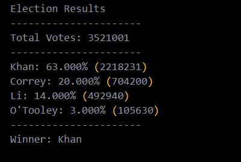

# PyBank & PyPoll Python Challenge

## 1.) PyBank
---
 In this challenge a [python script](pyBank/main.py) is to be generated to analyze the financial records of (small) demo company data set called [budget_data.csv](pyBank/Resources/budget_data.csv). The dataset is composed of two colums: Date and Profit/Losses.

 **The script should analyze records and calculate each of the following:**
 - The total number of months in the data set
 - the net total amount of "Profit/Losses" over the entire period
 - Calculate the changes if "Profit/Losses" over the entire period, the find the average of those changes
 - The greatest increase in profits (date and amount) over the entire period
 - The greatest decrease in profits (date and amount) over the entire period
### PyBank Financial Analysis Report 
----

## 2.) PyPoll
--- 
In this challange a [python script](pyPoll/main.py) is to be generated to analyze the election results of a demo election poll data called [election_data.csv](pyPoll/Resources/election_data.csv). The dataset is composed of three columns: Voter ID, County, and Candidate. 

**The script should analyzes the votes and calculates each of the following:**
- The total number of votes cast
- A complete list of candidates who received votes
- The percentage of votes each candidate won
- The total number of votes each candidate won
- The winner of the election based on popular vote
### PyPoll Election Results Report 
----

